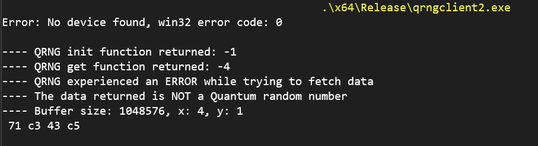

--- 

Title: "Quantum Dice QRNG API"

Brief description: "This repo contains Quantum Dice's QRNG API library, drivers, documentation and sample projects"

Copyright: "(c) Quantum Dice. All rights reserved"

---

## About this Repo 
### Overview 
The QRNG APIs (Quantum Random Number Generator - Application Programming Interface) provide an interface between a user application and Quantum dice's QRNG hardware, with these APIs the user is able to fetch truly random `Quantum Random Numbers` from the hardware. This repository also include sample programs that shows how a user can quickly and easily integrate the hardware with their software projects.

The QRNG APIs need Quantum Dice's QRNG hardware, without this hardware the functions would return an error.

## Requirements
1. Vertex B1: Quantum Dice QRNG hardware
2. OS: Windows 10 or Ubuntu 22.04 (kernel version 5.19)
3. Basic knowledge of C/C++/Python programming 
   
### Software Requirements 
1. gcc
2. cmake (optional)

## Files and directories
Below is the QRNGAPI package tree
```
QRNGAPI/
├─ doc/
│  ├─ ...
│  └─ index.html
├─ driver/
│  ├─ linux/
│  │  ├─ ...
│  │  ├─ qrng_driver_setup.sh
│  │  └─ README.md
│  ├─ windows/
│  │  ├─ ...
│  │  └─ README.md
├─ include/
│  └─ qrng_api.h
├─ lib/
│  ├─ libqrnglib.a
│  ├─ qrnglib.dll
│  └─ qrnglib.lib
├─ tests/
├─ ├─ ...
│  └─ simple/
│     ├─ ...
│     ├─ simple.cpp
│     └─ Makefile
├─ tools/
│  ├─ linux
│  └─ windows
└─ README.md
```  


| File        | Description |  
| :---        |    :----:   |
| ./doc/index.html      |  [QRNG API reference doc](./doc/index.html)      |
| ./include/qrng_api.h   |  [QRNG library header](./include/qrng_api.h) |
| ./lib/libqrnglib.a |  [QRNG static library](./lib/libqrnglib.a) for linux | 
| ./lib/qrnglib.lib | [QRNG static library](./lib/qrnglib.lib) for windows | 


## Setup and usage guide 
The sample programs can be found in the [tests](./tests) directory. Before running any of the sample projects install the device drivers.

### Install driver on linux 
1. Change directory to `./driver/linux` from the QRNGAPI home directory
    ``` 
    cd ./driver/linux 
    ```
2. Run the `qrng_driver_setup.sh` script as root. 
    ``` 
    sudo ./qrng_driver_setup.sh  
    ```
You should get a text like this at the end of the last command output: 
```
...
The Kernel module installed correctly and the xmda devices were recognized.
DONE
```


### Read the API documentation 
Before proceeding you can read the QRNG API [Reference doc](./doc/index.html) (NB: should be viewed in a web browser), this documentation shows all the functions, their arguments and expected return value. 

### Run the QRNG management tool
THe QRNG management tool is a utility that can be used to manage all the QRNG devices that are connected to a host machine. 

### Build and run the sample application 
The sample programs are platform independent and they have been tested on ubuntu 22.04 and Windows 10. Follow the  instructions below on how to compile and run the test program [simple.cpp](./tests/simple/simple.cpp) on either windows or linux. (NB: These sample programs can be found in `./tests/`)

#### Run on Windows
On windows you can build and run the sample programs with visual studio, visual studio project files have been included to ensure this is as simple as possible. 

1. Open the solution file [QuantumDiceQRNG-pub.sln](./tests/QuantumDiceQRNG-pub.sln) in visual studio

2. (Optional) Ensure that the header, libraries, and their directories are properly included by following the steps in the [Additional Information](#additional-information) section. 

3. Build the `simple` project with the following steps: 

   1. Select the `simple` project in the Solution Explorer, in Visual Studio
 
   2. You can use the shortcut `ctrl + b` or right-click the project name and select `build`

   3. After building the `simple` project, run the program with the executable `.\tests\Build\winx64\Release\simple.exe`

#### Run on Linux
On linux you can use the Makefile included in the `simple` project directory to build it. 
1. From the terminal, change directory to the project home 
    ``` 
    cd .\tests\simple 
    ```
2. Remove any existing build files 
    ```
    make clean
    ``` 
3. Build the binary 
    ```
    make
    ```  
4. Run the binary as root 
    ```
    sudo .\bin\simple
    ```

### Results and Expected output
After running the program, you should get an output like the one below if the hardware is not plugged into the machine.

<!--    -->
```
 QRNG init function status: -1
 QRNG experienced ERROR [-1] during initialization
```

The output shows that the `qrng_init` and `qrng_get` functions couldn't find any Quantum dice QRNG hardware, see the API documentation [Reference doc](./doc/index.html) for more information on the functions arguments, return values and error codes. 

The output below is what to expect if the hardware is plugged in and drivers installed. 
```
 QRNG init function status: 0
 QRNG get function returned: 0
         Print data, size: 104857600, row: 16, col: 10
         22 f7 f2 11 12 6a 5f 17 d6 da 28 d1 28 24 4c ce
         54 22 3f 90 93 d1 5c df 5f 19 d4 fa 5f eb ce b4
         60 d8 e1 9f a0 ab f8 6a a7 59 51 77 0a 6d 65 13
         86 9c 49 c1 6f 60 9d da 7c bd 89 11 9e 2a cf b4
         6f f4 e4 07 35 25 5c 1c ca 80 c0 c1 eb a1 4e 3b
         16 20 5a 15 2f bc 9f 25 dc 4e cf 84 1a 85 fd 04
         01 20 61 55 59 c8 70 75 da 5e f9 11 e2 de 9b 01
         9e c1 2f a1 54 6f ff e2 9c 16 3d 5c c6 17 b6 4b
         c1 cb a0 18 82 a9 6e 4f a3 03 22 bc 8e 5d 0c 64
         d5 f3 78 8b 03 fa 8f e7 50 b4 b7 1e b4 49 07 84
```

### How to get the Entropy bits, Certification Value and Raw entropy data 

The `qrng_get_with_ec` function in the API can be used to retrieve the Entropy bits and certification value data along side the QRNG hashed data, while the `qrng_get_raw_ent` is used to get the raw entropy data. Here is how to use the `qrng_get_with_ec` and `qrng_get_raw_ent` functions and the response to expect, see the project `tests\simple_ecr` for the source code of this program: 

NB: THIS FEATURE IS ONLY AVAILABLE CERTAIN FIRMWARE VERSIONS, these functions may return an error number or wrong data if used with the wrong firmware version, get more info from the support team to know which device to use these functions with. 


Output: 
```
 QRNG init ret: 0

 QRNG get function returned: 0
- QRNG hashed data:
 c7 32 94 e3 6c d8 d3 4d f3 e1 1c 59 c5 a1 05 37 9e be 20 c6 4f 69 85 1d a2 7e 67 6b 55 9a 3e 70

- QRNG certification data:
 64.27 64.25 64.28 64.27

- QRNG entropy bits:
 0078 0078 0078 0078

- QRNG raw entropy function returned: 0
 079f 0825 07e8 0894 08be 0600 0558 0722 0928 08c2 0895 077e 0744 074f 0768 08d4 0823 07a0 06b7 074a 06dc 078f 068b 0553 0846 08d1 0845 09d5 078b 0771 07f5 0980
```

The first set of numbers are the hashed data. 

The second is an array of certification values where the first element represents the certification value of the first 8 characters of hashed data, the second number represents the next 8 characters of hashed data, and so on.

The third is an array of Entropy bits where the first element represents the entropy bits of the first 8 characters of random numbers, and so on. 

The fourth is an array of raw Entropy, this set of data is not related to the first three and is fetched using the function `qrng_get_raw_ent`.


### Running other applications and tools
See the directory of the other sample programs for specific instructions on their functionalities, and how to use them. For example, the `filedump` program can be found in `./tests/filedump` and it is used to generate a specified amount of quantum random numbers and write them to a file.


### Additional information 
In case you encounter any build errors when building on windows, check the following settings:

1. Ensure that the `Solution Configurations` in Visual-studio is set to `Release`

2. Ensure that the `include` directory `$(SolutionDir)include\ ` is added to the c/c++ `Additional Include Directories`. 

3. Ensure that the QRNG library directory `$(SolutionDir)lib ` is included in the linker `Additional Library Directories`

4. Ensure that `qrngprov.lib` is included in the linker `Additional Dependencies`

5. Ensure that the `qrngprov.lib` and `qrngprov.dll` library files are present in the `.\lib` directory


